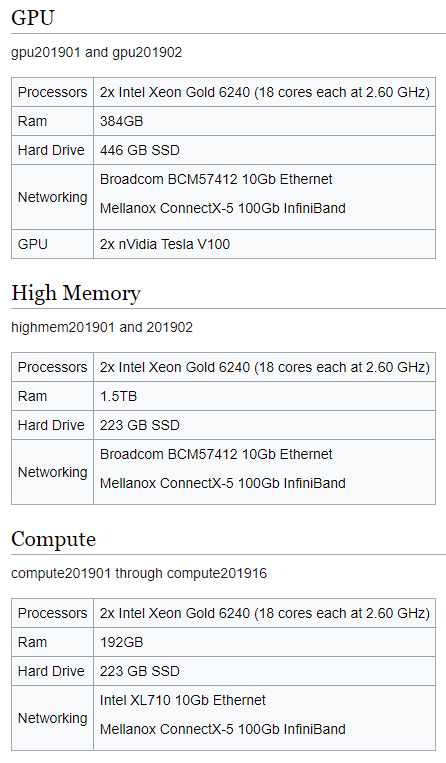

# Notes and Documentation Links

I hate reinventing the wheel & looking for the same information twice...

## BeoShock Docs

- General overview
  - https://www.wichita.edu/services/hpc/hpc-guides.php
- Wiki - requires school VPN or physical presence on network :/
  - Main Page: https://docs.hpc.wichita.edu/index.php?title=Main_Page
  - Slurm Basics: https://docs.hpc.wichita.edu/index.php?title=SlurmBasics
  - Advanced Slurm: https://docs.hpc.wichita.edu/index.php?title=AdvancedSlurm
  - Compute Nodes: https://docs.hpc.wichita.edu/index.php?title=Compute_Nodes
    - Spoiler: not much
    - Good news?  CPU heterogeneity- all Xeon Gold 6240 cpus.
    - 

